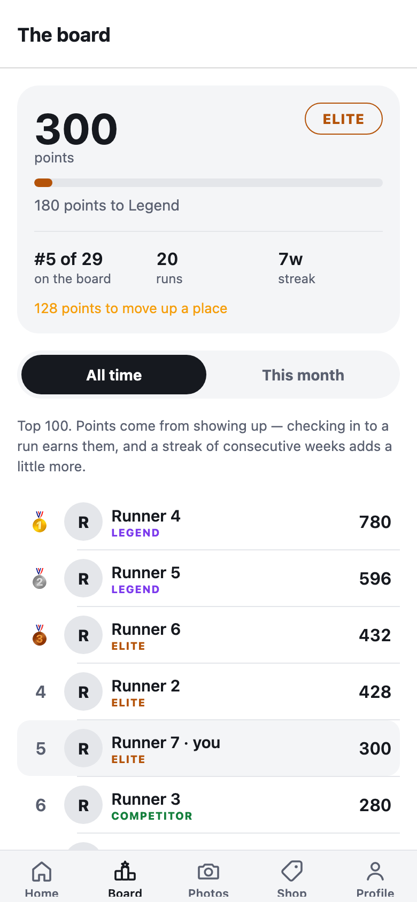
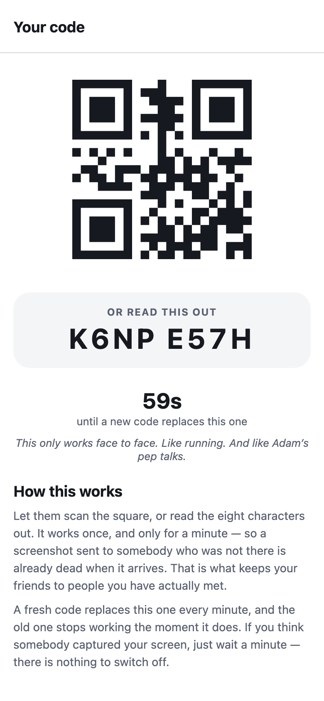
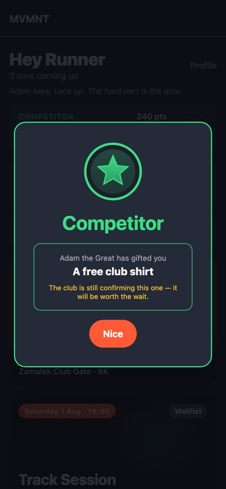
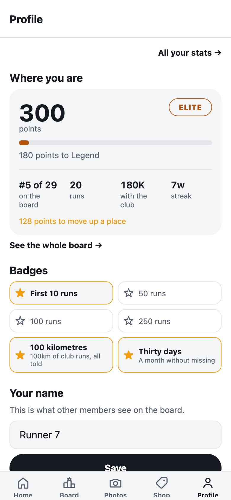
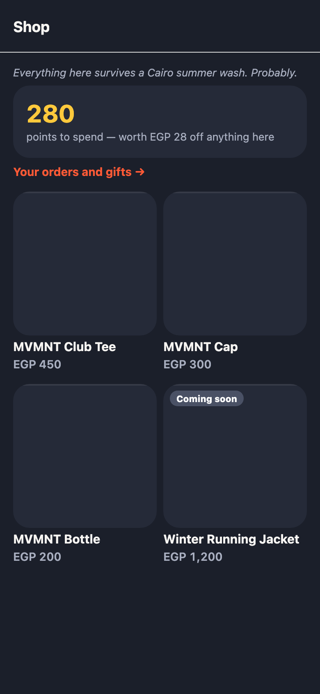
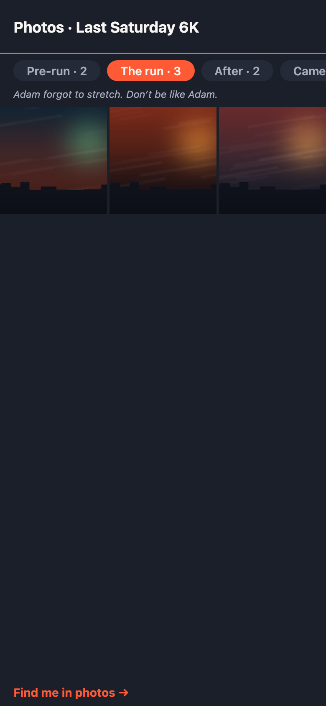
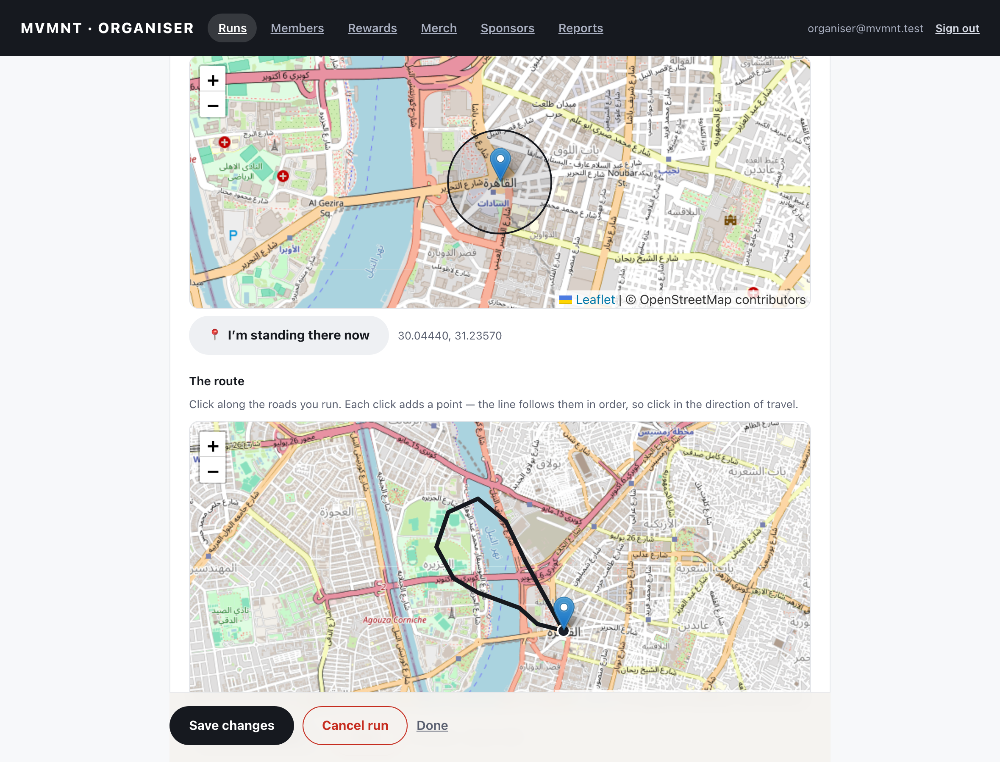
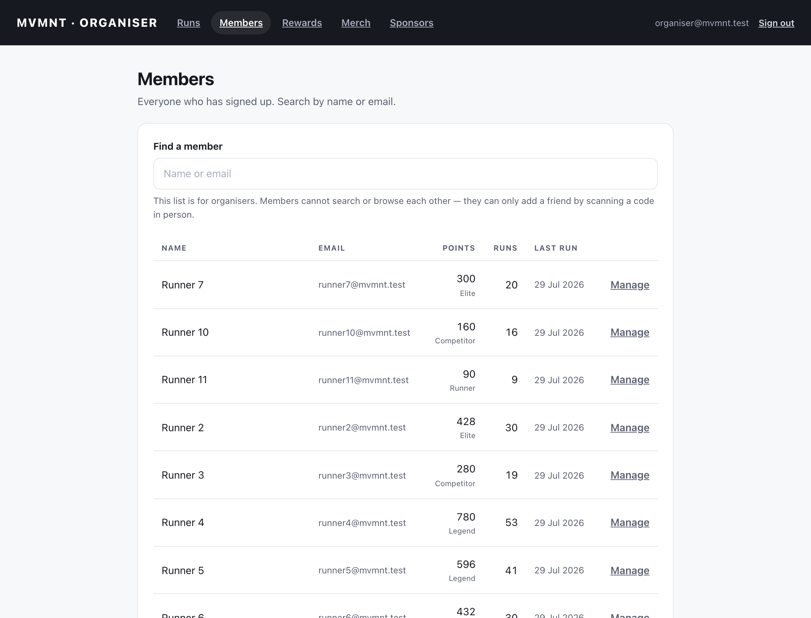
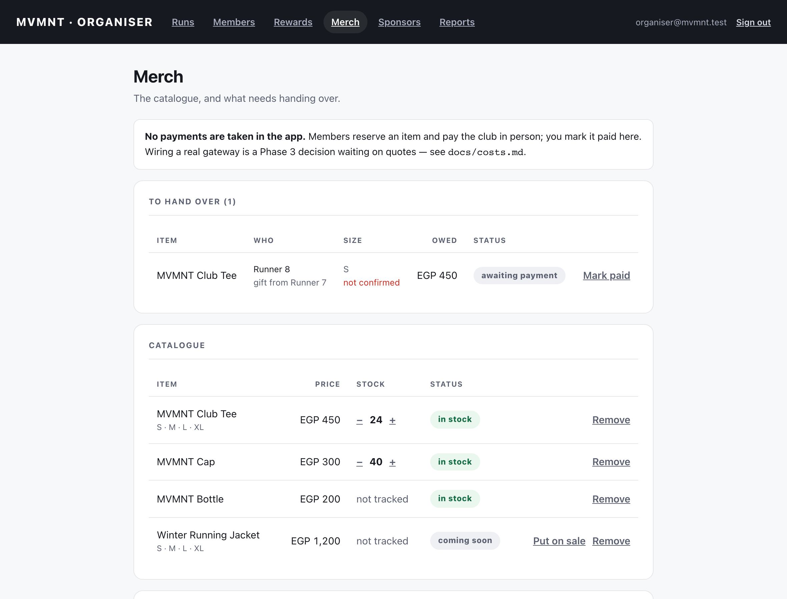

# MVMNT

**A run club app for iOS, Android and the organisers' laptop.**

MVMNT is a Cairo running club that draws 300+ people to a weekly run — and once
put 2,500 on the start line. All of it is currently coordinated through
WhatsApp, Instagram and word of mouth. This replaces that.

[](https://github.com/Adammm48/mvmnt/actions/workflows/ci.yml)

> **Status: Phases 1–4 complete, not yet deployed.** Sign-up, geofenced
> check-in, the notification pipeline, the organiser console, the loyalty system
> (points, streaks, tiers, badges), the club leaderboard, the QR-only friends
> system, and the merch shop with gifts and sponsor placements are built and
> tested, along with Phase 4's routes (drawn in the console, rendered as a
> shape in the app), photo galleries in a private bucket, and opt-in live
> location that is friends-only and structurally incapable of recording a
> trail ([ADR 0004](docs/decisions/0004-live-tracking.md)). **No payment
> gateway is wired in** — Stripe does not serve Egypt-based businesses and the
> alternative needs quotes the club has not obtained, so orders stop at
> "reserved" and the club takes payment in person. Phase 5 (HealthKit, AI
> face-matching) is specified and deliberately unbuilt. See
> [docs/backlog.md](docs/backlog.md), and [docs/debrief.md](docs/debrief.md)
> for the whole build in one read — every phase, the bugs worth remembering,
> and the owner's to-do list.
>
> Built against [`docs/spec/MVMNT_App_Spec_1.md`](docs/spec/MVMNT_App_Spec_1.md)
> and [`docs/spec/MVMNT_Engineering_Principles.md`](docs/spec/MVMNT_Engineering_Principles.md),
> the two documents that set what to build and how. A few things shipped
> differently from what the spec says, on the owner's explicit instruction after
> the fact — five loyalty tiers instead of three, a 60-second single-use
> friend code instead of a persistent regenerable one, and no points penalty
> for missed runs (built, then removed: it hands a member who has drifted a
> reason not to come back). All are recorded in the commit history and in
> `docs/backlog.md` rather than silently overriding the spec.

---

<p align="center">
  
</p>

<p align="center"><em>Checking in at the meeting point. The geofence offers it; the server decides.</em></p>

| The member's app | The run detail |
|---|---|
|  |  |

<p align="center"><em>The route on the run detail is the organiser's drawing, rendered as a shape with SVG rather than a tiled map — what a member wants the night before is the loop and the distance, not street names, and it costs no map SDK, no API key and no per-platform rendering to QA.</em></p>

| The board | The friend code |
|---|---|
|  |  |

<p align="center"><em>Your own standing sits above the board, because most of the club will never be in the top 100. The friend code is shown twice — as a square to scan and as eight characters to read aloud — and rolls every sixty seconds, which is the entire reason "in person only" is true rather than merely intended.</em></p>

| Reaching a tier | Your badges |
|---|---|
|  |  |

| The shop | The photos |
|---|---|
|  |  |

<p align="center"><em>Run photos keep the club's existing Drive folders — pre-run, the run, after, camera — but live in a private bucket: photos of identifiable people at a known place and time are personal data, so every image is a short-lived signed URL for a signed-in member, and nothing is visible until the organiser publishes. Publishing notifies exactly the people who checked in.</em></p>

<p align="center"><em>Points buy a discount and can be sent as a gift, but only to somebody added by scanning their code in person. No payment gateway is wired in — Stripe does not serve Egypt-based businesses — so an order reserves stock and the club takes payment in person.</em></p>

<p align="center"><em>Crossing a tier is recorded server-side as an event, so the celebration survives a reinstall and cannot fire twice across two phones. It opens on a tap — this arrives thirty seconds after checking in, when the member is standing in a car park in the cold.</em></p>

**The organiser's console** — no developer required, which is the whole point of it.




<p align="center"><em>Routes are drawn by clicking along the streets, and published as a separate act from saving — sketching on Tuesday should not notify three hundred people. Coordinates are validated server-side in GeoJSON order, because a transposed pair renders the route off the coast of Somalia.</em></p>






<p align="center"><em>The one screen in MVMNT that lists the whole membership — organiser-only, and a <code>SECURITY DEFINER</code> function rather than a relaxed policy. Members still read exactly one profile: their own.</em></p>

---

## What makes this more than CRUD

**Every business rule lives in Postgres.** Capacity, waitlist ordering, the
check-in geofence, who may edit a run — all in `SECURITY DEFINER` functions with
Row Level Security underneath. The apps call and render; they never decide. So
there is no rule in the mobile app that can drift from the admin console, and
no client-side check to bypass.

That makes the schema the interesting part of this repo. Start at
[`20260727090300_attendance.sql`](supabase/migrations/20260727090300_attendance.sql).

**Three examples of the problems that actually shaped it:**

<details>
<summary><strong>The waitlist that silently reordered itself</strong></summary>

The waitlist is FIFO, and the obvious ordering key is `signed_up_at`. But
promotion off the waitlist *sets* `signed_up_at = now()` — overwriting the very
key it ordered by. The queue quietly reshuffles and nothing errors.

Fixed with a separate `queued_at`, immutable except on a genuine re-join, and
enforced by a trigger rather than by remembering not to write it. There is a
test that asserts promotion leaves it untouched.

Found by a design review before any code was written — see
[the transcript](docs/council/2026-07-27-phase1-data-model-transcript.md).
</details>

<details>
<summary><strong>RLS policies that were dead letters</strong></summary>

Current Supabase versions no longer blanket-grant table privileges on new
tables. Every policy was written correctly, and `authenticated` reached every
table with **no SELECT at all** — so the app could not read a run, or even its
own profile.

A local test harness that mimicked the older, permissive behaviour passed every
access-control test. Running the real stack caught it in minutes. Grants are now
an explicit allowlist, and [docs/api.md](docs/api.md) documents the two-gate
model so the next person does not assume a permissive baseline.
</details>

<details>
<summary><strong>Append-only history versus the right to erasure</strong></summary>

Attendance history is append-only so the club can see signup-versus-turnout.
GDPR Article 17 says a member can demand deletion. Those two requirements are in
direct conflict, and the trigger enforcing the first one blocked the second —
because anonymising via `ON DELETE SET NULL` is itself an UPDATE.

Resolved by permitting exactly one kind of update: clearing a reference to a
person, and nothing else. Personal data is destroyed; the anonymous fact that
somebody attended survives, so headcounts for past runs stay correct.
</details>

**Designed for the burst, not the average.** Normal is ~300 people; one event hit
2,500. Notification fan-out is a queue-and-worker with per-device retry and
idempotency at both levels — without that, a single scheduler retry double-pushes
every member, which at 2,500 people is 2,500 duplicate notifications from one
transient failure. Check-in deliberately takes **no** row lock, because a mass
start means hundreds of simultaneous check-ins and serialising them on one run
row is exactly the contention to avoid.

**Privacy is a design constraint, not a policy page.** There is no member
directory: a member can read exactly one profile, their own. Capacity renders as
"Limited spots" through an aggregate view that selects no identifying column.
Check-in coordinates are kept 30 days and then hard-deleted by a scheduled job —
the retention rule is executable, not just written down.

Phase 2 opened exactly two windows in that wall, both through
`SECURITY DEFINER` functions rather than by relaxing a policy: the leaderboard
(name, avatar, points — and a per-member opt-out), and a friends list (name and
a single in/out flag for one upcoming run). Neither can reach a run-by-run
history, which is the thing that would turn either into the attendance log the
club asked to hide.

Organisers do get a searchable directory, in the console only, because they can
already assemble one by hand from the run-day lists — withholding the convenient
version would have cost usefulness without buying privacy. It is a third
`SECURITY DEFINER` function that refuses anyone who is not an admin; the members'
own `profiles` policy is untouched and still returns exactly one row.

**Being added as a friend requires being there.** The code lives sixty seconds,
burns on first scan, and each new one retires the last — so a screenshot
forwarded to somebody who was not standing there is dead on arrival. It is eight
characters rather than thirty-two because the fallback the whole feature depends
on is one person reading it aloud when a camera will not focus, and 40 bits
against a one-minute single-use window is not a practical target. None of that
is visible in the UI, so [`07_friends.sql`](supabase/tests/07_friends.sql) tests
each property directly.

**Points can go down.** Reaching Legend takes six months of not missing a
Saturday — a number derived from the scoring rules rather than picked, and
asserted in a test so changing either cannot silently move the ladder. That
ceiling only works because absence costs: the first missed run is free, and from
the second consecutive one a member loses exactly what attending earns, never
below zero. Without it every regular is Legend forever by their second season
and the top rung measures nothing.

---

## Architecture

```
apps/mobile      Expo (iOS + Android), dev-client/prebuild, expo-router
apps/admin       React + Vite organiser console
packages/shared  Generated DB types, design tokens, formatters
supabase/        Migrations, RPCs, RLS, Edge Functions, tests
docs/            Decision records, API reference, design-review transcript
```

| Layer | Choice | Why |
|---|---|---|
| Mobile | React Native via Expo | One codebase, both stores. Dev-client from day one so Phase 5 HealthKit needs no migration |
| Backend | Supabase (Postgres, Auth, Storage, Edge Functions) | The relational model maps onto the domain with no translation layer |
| Rules | `SECURITY DEFINER` functions + RLS | One place per rule, enforced where the data is |
| Console | Separate React web app | The organiser needs a browser, not an app install or a release cycle |
| Maps | Leaflet + OpenStreetMap | No API key for dropping one pin |

**Decisions worth reading before changing anything:**

- [ADR 0001 — Phase 1 data model](docs/decisions/0001-phase-1-data-model.md) —
  timestamps over booleans, why `queued_at` exists, what was deliberately left out
- [ADR 0002 — Check-in, location and retention](docs/decisions/0002-check-in-location-and-retention.md) —
  why the geofence *prompts* rather than decides, why organiser check-in is the
  primary mitigation, and the 30-day retention rule
- [ADR 0003 — The leaderboard and QR friends](docs/decisions/0003-leaderboard-visibility-and-loyalty.md) —
  a design review argued unanimously against the named public leaderboard; the
  owner chose it anyway. This records the reasoning, the residual risks, and the
  opt-out added to answer them
- [The design review](docs/council/2026-07-27-phase1-data-model-transcript.md) —
  five independent reviews that changed ten schema decisions before code existed
- [docs/api.md](docs/api.md) — every RPC: purpose, inputs, permissions, errors

---

## Testing

Depth tracks risk. Security- and money-sensitive flows get the full treatment;
admin CRUD gets a lighter pass.

```bash
npm run db:test
```

Ten suites over attendance and waitlist ordering, geofenced check-in, every RLS
policy, notification idempotency, retention and erasure, the points, streak,
badge and tier rules, organiser role changes, the friend-code safety
properties, the shop — stock under concurrency, points that cannot be spent
twice, sponsor reach that cannot be inflated by a client — the photo
galleries' bytes gate (an object with no registered row is invisible, not
leaked), and live positions (one row per member so a trail cannot exist, and
the three ways a dot dies). They run inside transactions and roll back, so
they are safe against a seeded database.

Two of the checks are structural rather than behavioural: every table in
`public` must have RLS enabled, and every `SECURITY DEFINER` function must pin
its `search_path` — so the next migration that forgets either fails the suite
instead of shipping a hole.

**A recurring bug class worth naming:** four separate features shipped with a
platform call that failed silently — `Alert` (`static alert() {}` on web),
`window.confirm` (returns `false` when a browser suppresses it),
`navigator.share` (undefined nearly everywhere), and `flush().catch(() => {})`
on the offline check-in queue. Each looked correct, ran without error, and told
nobody anything. Every one of them is now required to report an outcome, and the
tests assert that the member was told rather than that the function ran.

**RLS cannot be tested by clicking around** — the UI only ever asks for data it
is supposed to have, so a policy hole is invisible from the front end and
obvious in [`03_access_control.sql`](supabase/tests/03_access_control.sql).

CI runs all of it against a real Supabase stack on every push, plus a check that
the committed generated types still match the migrations.

---

## Running it

Needs Node 20+ and Docker (Colima works and needs no privileged helper).

```bash
npm install
colima start
npm run db:start      # Supabase: Postgres, Auth, Storage, Edge Functions
npm run db:reset      # migrations + seed + placeholder cover images
```

Copy `.env.example` into `apps/mobile/.env` and `apps/admin/.env` with the keys
`db:start` printed.

```bash
npm run db:test                        # database suite
npm run --workspace @mvmnt/admin dev   # organiser console → :5173
npm run --workspace @mvmnt/mobile web  # app in a browser → :8081
```

Seeded accounts: `organiser@mvmnt.test` is an admin, `runner2@…`–`runner30@…`
are members. Sign-in is by emailed 6-digit code — read it at
**http://127.0.0.1:54324**, which catches every local email.

`EXPO_PUBLIC_DEV_FAKE_LOCATION=30.0444,31.2357` lets you exercise geofenced
check-in without standing at the meeting point. Ignored in release builds.

| Command | Does |
|---|---|
| `npm run db:reset` | Rebuild from migrations, reseed, re-upload cover images |
| `npm run db:types` | Regenerate the shared types — run after any migration |
| `npm run docs:screenshots` | Recapture the README stills from the running apps |
| `node scripts/load-test.mjs` | Burst-test sign-up, check-in, live positions and fan-out — [results](docs/load-test.md) |
| `npm run docs:gif` | Recapture the check-in animation |
| `npm run check:placeholders` | List everything still waiting on a real answer |

---

## If the club is locked out

Organiser access is one field on a profile, and the founding account is
protected from demotion precisely so this should not happen. It still can: the
owner can lose access to their email, or delete their own account, which is
their right.

**There is no hidden recovery account, and deliberately so.** An account the
club cannot see is one they cannot revoke, and it would make the privacy policy
untrue — it says organisers can see everything and every action is logged.

Recovery instead uses the credentials whoever runs the project already holds.
`service_role` and `postgres` both carry `rolbypassrls`, so anyone with the
Supabase project can already read and write every table; and the role guard in
[migration 0022](supabase/migrations/20260729110000_organiser_roles_and_member_detail.sql)
exempts callers with no authenticated identity, which is what the SQL editor is.
That is the same path the first organiser was created through.

Open Supabase → SQL Editor and run
[`scripts/restore-organiser.sql`](scripts/restore-organiser.sql). It checks
whether anyone still has access before changing anything, promotes one named
email, and prints the audit trail. Then tell the owner it was done — an
organiser appearing from nowhere is indistinguishable from a compromise.

---

## Before it goes live

```bash
npm run check:placeholders
```

Lists every placeholder still waiting on a real answer — who can answer it, and
what breaks if it ships as-is. It reads the source rather than a hand-kept list,
because a list of "fix later" goes stale the first time somebody fixes one and
forgets to cross it off. Reasoning behind each is in
[docs/open-items.md](docs/open-items.md).

1. **Apple Developer Program**, enrolled to MVMNT. Organisation enrolment needs a
   D-U-N-S number, which takes 1–2 weeks to verify. Gates Sign in with Apple,
   push, TestFlight and release.
2. **Firebase project** for Android push; **Google Play Console** for the listing.
3. **A published privacy policy.** Both stores require one, at a public URL.
   A draft describing exactly what the app does is in
   [docs/privacy-policy.md](docs/privacy-policy.md) — it still needs a
   qualified review and its placeholders filled in.
4. **Choose the Supabase region deliberately.** The club is in Cairo, so Egypt's
   PDPL applies and cross-border transfer rules are in play. Far cheaper to
   decide now than to migrate production data later — see ADR 0002 §8.

Until 1 and 2 exist, the `push_delivery` flag stays off and notifications are
recorded rather than sent. The pipeline is real and observable in
`notification_deliveries`; only the outbound call is skipped.

---

## Conventions

- **Never edit the schema through the Supabase dashboard.** Migrations are the
  source of truth; a dashboard edit is invisible to everyone else and lost on
  the next reset.
- **Regenerate types after every migration** and commit them — CI fails if they
  drift.
- **Comments explain *why*.** The what is in the code.

## Credit

Built by [Adam Elbasiony](https://github.com/Adammm48) with Claude as a pair.
Commits carry `Co-Authored-By` trailers where that applies — the reasoning behind
every significant decision is written down in `docs/decisions/` precisely so it
can be defended rather than merely shipped.

[MIT](LICENSE).
