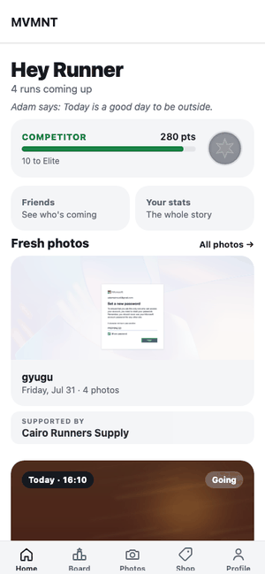
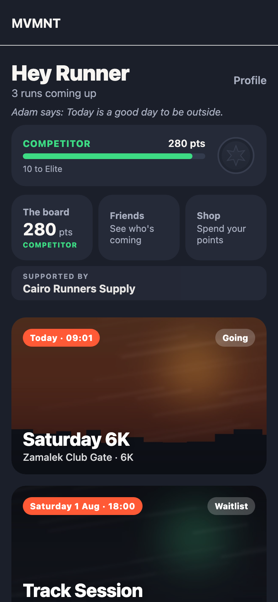
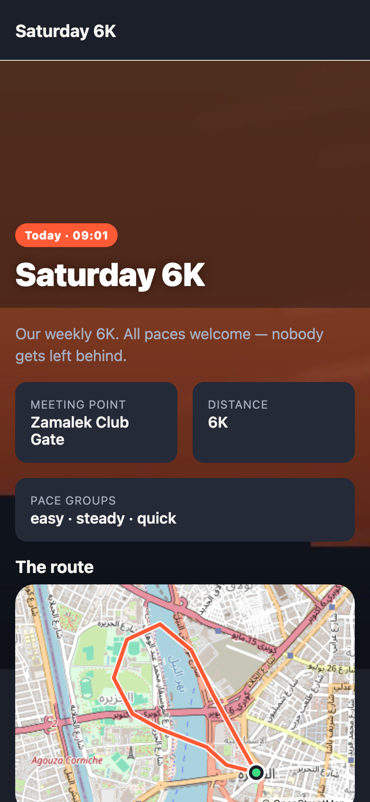
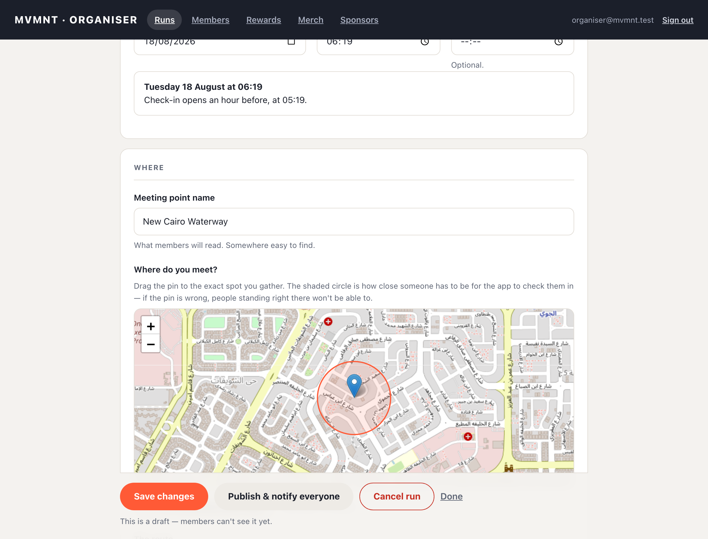
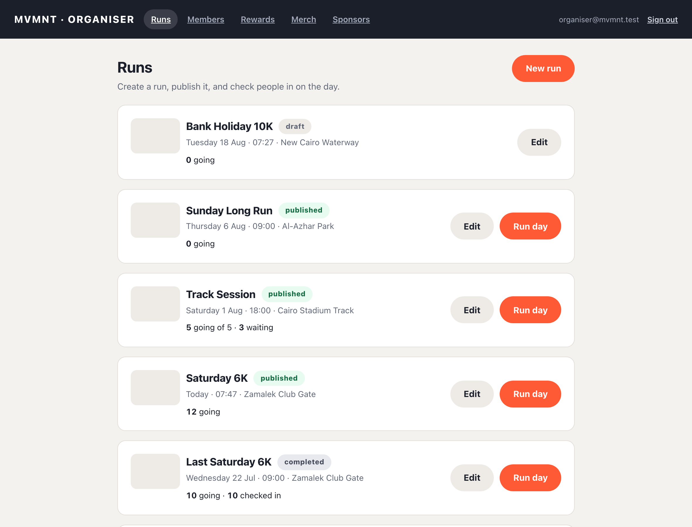

# MVMNT

**A run club app for iOS, Android and the organisers' laptop.**

MVMNT is a Cairo running club that draws 300+ people to a weekly run — and once
put 2,500 on the start line. All of it is currently coordinated through
WhatsApp, Instagram and word of mouth. This replaces that.

[](https://github.com/Adammm48/mvmnt/actions/workflows/ci.yml)

> **Status: Phase 1 complete, not yet deployed.** Sign-up, run sign-up,
> geofenced check-in, the notification pipeline and the organiser console are
> built and tested. The club is not using it yet — that waits on an Apple
> Developer account and a privacy policy, not on more code. Phases 2–5
> (leaderboard, QR friends, sponsors, merch, routes, photo galleries, HealthKit)
> are specified and deliberately unbuilt. See [docs/backlog.md](docs/backlog.md).

---

<p align="center">
  
</p>

<p align="center"><em>Checking in at the meeting point. The geofence offers it; the server decides.</em></p>

| The member's app | The run detail |
|---|---|
|  |  |

**The organiser's console** — no developer required, which is the whole point of it.





---

## What makes this more than CRUD

**Every business rule lives in Postgres.** Capacity, waitlist ordering, the
check-in geofence, who may edit a run — all in `SECURITY DEFINER` functions with
Row Level Security underneath. The apps call and render; they never decide. So
there is no rule in the mobile app that can drift from the admin console, and
no client-side check to bypass.

That makes the schema the interesting part of this repo. Start at
[`20260727090300_attendance.sql`](supabase/migrations/20260727090300_attendance.sql).

**Three examples of the problems that actually shaped it:**

<details>
<summary><strong>The waitlist that silently reordered itself</strong></summary>

The waitlist is FIFO, and the obvious ordering key is `signed_up_at`. But
promotion off the waitlist *sets* `signed_up_at = now()` — overwriting the very
key it ordered by. The queue quietly reshuffles and nothing errors.

Fixed with a separate `queued_at`, immutable except on a genuine re-join, and
enforced by a trigger rather than by remembering not to write it. There is a
test that asserts promotion leaves it untouched.

Found by a design review before any code was written — see
[the transcript](docs/council/2026-07-27-phase1-data-model-transcript.md).
</details>

<details>
<summary><strong>RLS policies that were dead letters</strong></summary>

Current Supabase versions no longer blanket-grant table privileges on new
tables. Every policy was written correctly, and `authenticated` reached every
table with **no SELECT at all** — so the app could not read a run, or even its
own profile.

A local test harness that mimicked the older, permissive behaviour passed every
access-control test. Running the real stack caught it in minutes. Grants are now
an explicit allowlist, and [docs/api.md](docs/api.md) documents the two-gate
model so the next person does not assume a permissive baseline.
</details>

<details>
<summary><strong>Append-only history versus the right to erasure</strong></summary>

Attendance history is append-only so the club can see signup-versus-turnout.
GDPR Article 17 says a member can demand deletion. Those two requirements are in
direct conflict, and the trigger enforcing the first one blocked the second —
because anonymising via `ON DELETE SET NULL` is itself an UPDATE.

Resolved by permitting exactly one kind of update: clearing a reference to a
person, and nothing else. Personal data is destroyed; the anonymous fact that
somebody attended survives, so headcounts for past runs stay correct.
</details>

**Designed for the burst, not the average.** Normal is ~300 people; one event hit
2,500. Notification fan-out is a queue-and-worker with per-device retry and
idempotency at both levels — without that, a single scheduler retry double-pushes
every member, which at 2,500 people is 2,500 duplicate notifications from one
transient failure. Check-in deliberately takes **no** row lock, because a mass
start means hundreds of simultaneous check-ins and serialising them on one run
row is exactly the contention to avoid.

**Privacy is a design constraint, not a policy page.** There is no member
directory: a member can read exactly one profile, their own. The run detail says
"312 people are in" through an aggregate view that selects no identifying
column. Check-in coordinates are kept 30 days and then hard-deleted by a
scheduled job — the retention rule is executable, not just written down.

---

## Architecture

```
apps/mobile      Expo (iOS + Android), dev-client/prebuild, expo-router
apps/admin       React + Vite organiser console
packages/shared  Generated DB types, design tokens, formatters
supabase/        Migrations, RPCs, RLS, Edge Functions, tests
docs/            Decision records, API reference, design-review transcript
```

| Layer | Choice | Why |
|---|---|---|
| Mobile | React Native via Expo | One codebase, both stores. Dev-client from day one so Phase 5 HealthKit needs no migration |
| Backend | Supabase (Postgres, Auth, Storage, Edge Functions) | The relational model maps onto the domain with no translation layer |
| Rules | `SECURITY DEFINER` functions + RLS | One place per rule, enforced where the data is |
| Console | Separate React web app | The organiser needs a browser, not an app install or a release cycle |
| Maps | Leaflet + OpenStreetMap | No API key for dropping one pin |

**Decisions worth reading before changing anything:**

- [ADR 0001 — Phase 1 data model](docs/decisions/0001-phase-1-data-model.md) —
  timestamps over booleans, why `queued_at` exists, what was deliberately left out
- [ADR 0002 — Check-in, location and retention](docs/decisions/0002-check-in-location-and-retention.md) —
  why the geofence *prompts* rather than decides, why organiser check-in is the
  primary mitigation, and the 30-day retention rule
- [The design review](docs/council/2026-07-27-phase1-data-model-transcript.md) —
  five independent reviews that changed ten schema decisions before code existed
- [docs/api.md](docs/api.md) — every RPC: purpose, inputs, permissions, errors

---

## Testing

Depth tracks risk. Security- and money-sensitive flows get the full treatment;
admin CRUD gets a lighter pass.

```bash
npm run db:test
```

Five suites over attendance and waitlist ordering, geofenced check-in, every RLS
policy, notification idempotency, and retention/erasure. They run inside
transactions and roll back, so they are safe against a seeded database.

**RLS cannot be tested by clicking around** — the UI only ever asks for data it
is supposed to have, so a policy hole is invisible from the front end and
obvious in [`03_access_control.sql`](supabase/tests/03_access_control.sql).

CI runs all of it against a real Supabase stack on every push, plus a check that
the committed generated types still match the migrations.

---

## Running it

Needs Node 20+ and Docker (Colima works and needs no privileged helper).

```bash
npm install
colima start
npm run db:start      # Supabase: Postgres, Auth, Storage, Edge Functions
npm run db:reset      # migrations + seed + placeholder cover images
```

Copy `.env.example` into `apps/mobile/.env` and `apps/admin/.env` with the keys
`db:start` printed.

```bash
npm run db:test                        # database suite
npm run --workspace @mvmnt/admin dev   # organiser console → :5173
npm run --workspace @mvmnt/mobile web  # app in a browser → :8081
```

Seeded accounts: `organiser@mvmnt.test` is an admin, `runner2@…`–`runner30@…`
are members. Sign-in is by emailed 6-digit code — read it at
**http://127.0.0.1:54324**, which catches every local email.

`EXPO_PUBLIC_DEV_FAKE_LOCATION=30.0444,31.2357` lets you exercise geofenced
check-in without standing at the meeting point. Ignored in release builds.

| Command | Does |
|---|---|
| `npm run db:reset` | Rebuild from migrations, reseed, re-upload cover images |
| `npm run db:types` | Regenerate the shared types — run after any migration |
| `npm run docs:screenshots` | Recapture the README stills from the running apps |
| `npm run docs:gif` | Recapture the check-in animation |

---

## Before it goes live

1. **Apple Developer Program**, enrolled to MVMNT. Organisation enrolment needs a
   D-U-N-S number, which takes 1–2 weeks to verify. Gates Sign in with Apple,
   push, TestFlight and release.
2. **Firebase project** for Android push; **Google Play Console** for the listing.
3. **A published privacy policy.** Both stores require one. Writing, not
   engineering — and usually what holds a release up.
4. **Choose the Supabase region deliberately.** The club is in Cairo, so Egypt's
   PDPL applies and cross-border transfer rules are in play. Far cheaper to
   decide now than to migrate production data later — see ADR 0002 §8.

Until 1 and 2 exist, the `push_delivery` flag stays off and notifications are
recorded rather than sent. The pipeline is real and observable in
`notification_deliveries`; only the outbound call is skipped.

---

## Conventions

- **Never edit the schema through the Supabase dashboard.** Migrations are the
  source of truth; a dashboard edit is invisible to everyone else and lost on
  the next reset.
- **Regenerate types after every migration** and commit them — CI fails if they
  drift.
- **Comments explain *why*.** The what is in the code.

## Credit

Built by [Adam Elbasiony](https://github.com/Adammm48) with Claude as a pair.
Commits carry `Co-Authored-By` trailers where that applies — the reasoning behind
every significant decision is written down in `docs/decisions/` precisely so it
can be defended rather than merely shipped.

[MIT](LICENSE).
